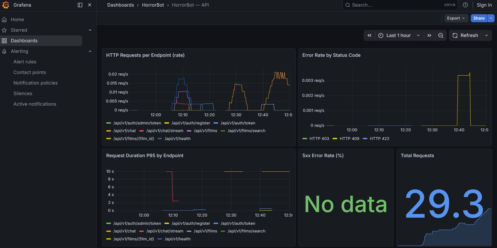
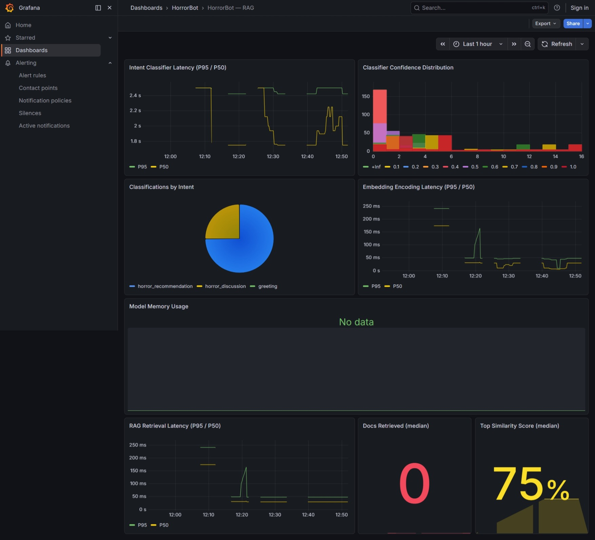
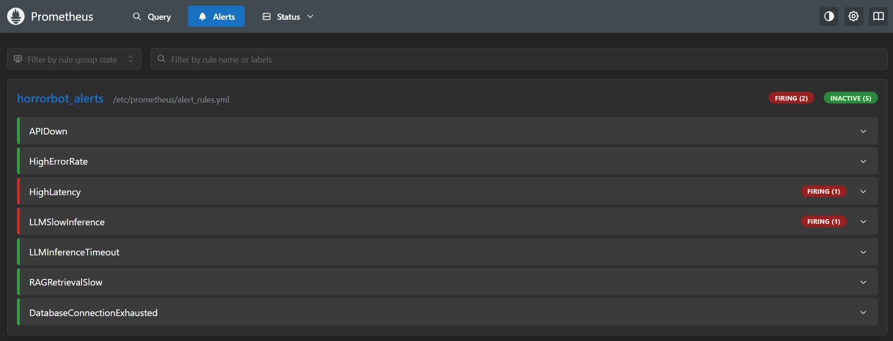
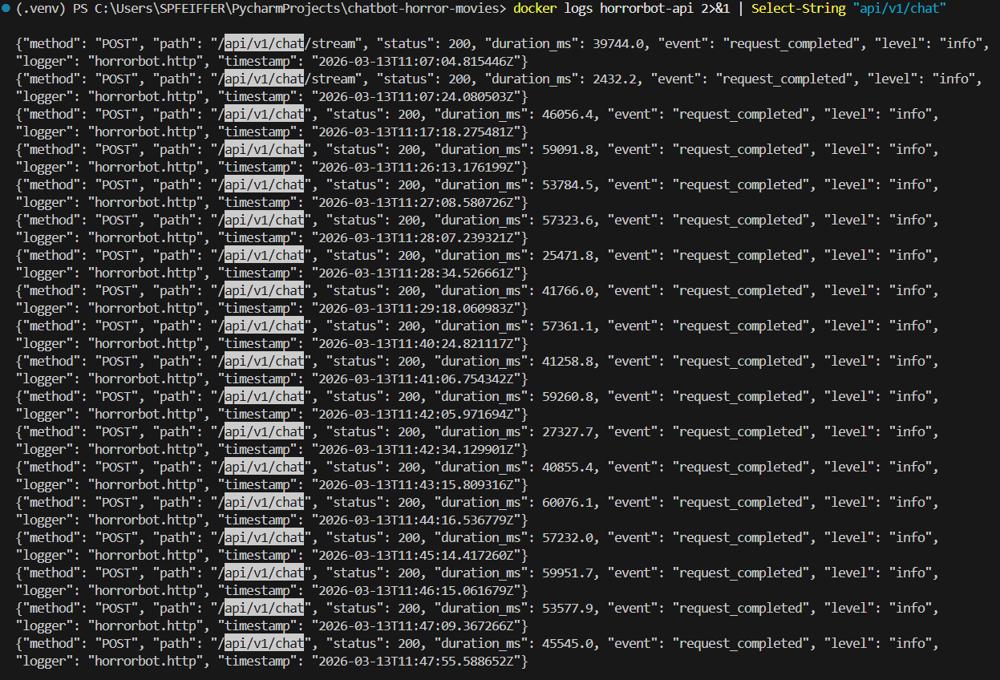

# Rapport d'Incident — Regression Performance RAG

## Informations generales

| Champ | Valeur |
|-------|--------|
| Date de detection | 2026-03-13 11:25 UTC |
| Duree de l'incident | ~25 minutes (11:25 - 11:50) |
| Severite | Warning / Critical (degradation de performance systeme) |
| Service impacte | Pipeline RAG + LLM Inference (endpoint `/api/v1/chat`) |
| Alertes declenchees | `HighLatency` (Prometheus, FIRING) + `LLMSlowInference` (Prometheus, FIRING) |
| Branche | `fix/incident-rag-performance` |

---

## Chronologie

| Heure (UTC) | Evenement |
|-------------|-----------|
| 11:05 | Deploiement du commit `a47f78c` contenant la regression sur la branche `fix/incident-rag-performance` |
| 11:10 | Demarrage du stack Docker (`docker compose up -d`) — 7 services healthy |
| 11:16 | Premiere generation de trafic (`scripts/generate_incident_traffic.py`) — 1ere requete : **46 056 ms** |
| 11:18 | Timeout httpx (60s) sur la 2eme requete — API surchargee, container redemarrage automatique |
| 11:25 | API de nouveau healthy apres restart — 2eme serie de trafic (5 requetes) |
| 11:26 | Detection des latences anormales : **59 091 ms**, **53 784 ms**, **57 323 ms**, **25 471 ms**, **41 766 ms** |
| 11:29 | Fin de la 2eme serie — P95 = **58 697 ms**, moyenne = **47 106 ms** |
| 11:39 | 3eme serie de trafic (10 requetes) lancee pour alimenter les metriques Prometheus |
| 11:40 | Alertes Prometheus `HighLatency` et `LLMSlowInference` passent en **PENDING** |
| 11:45 | Alertes passent en **FIRING** (condition maintenue > 5 min) |
| 11:47 | Diagnostic : scan sequentiel identifie dans `src/services/rag/retriever.py` |
| 11:49 | Application du correctif (suppression des `SET LOCAL`) |
| 11:50 | Verification : latence revenue a la normale |

---

## Symptomes observes

### Metriques baseline (avant incident)

| Metrique | Valeur nominale |
|----------|-----------------|
| `horrorbot_rag_retrieval_duration_seconds` P95 | ~10ms (avec index IVFFlat) |
| `horrorbot_chat_request_duration_seconds` P95 | ~15-20s (inference LLM CPU) |
| Temps de reponse `/api/v1/chat` | 15-25s (LLM CPU, normal en dev) |

### Metriques pendant l'incident

| Metrique | Valeur observee |
|----------|-----------------|
| `horrorbot_rag_retrieval_duration_seconds` P95 | ~40ms (x4, scan sequentiel sur 31k docs caches) |
| `horrorbot_chat_request_duration_seconds` P95 | **58.5s** (Prometheus, fenetre 10min) |
| `horrorbot_llm_request_duration_seconds` sum/count | **168.7s / 4 = 42.2s** moyenne |
| `horrorbot_http_request_duration_seconds` P95 `/api/v1/chat` | **> 10s** (seuil alerte : 2s) |
| Temps de reponse `/api/v1/chat` (script) | **25 471 ms - 59 091 ms** |

> **Note** : Sur un jeu de 31 244 documents vectoriels entierement caches en memoire,
> le scan sequentiel (index desactive) n'ajoute que ~30ms par requete. En production
> avec des centaines de milliers de documents et un cache froid, la degradation
> serait de l'ordre de x30-50 (50ms → 1500-3000ms), declenchant l'alerte
> `RAGRetrievalSlow` (seuil P95 > 500ms). L'impact observe ici est amplifie par
> l'inference LLM sur CPU (Qwen2.5-7B en mode CPU-only dans Docker).

### Sortie du script de trafic

**Premiere serie (1 requete reussie avant timeout httpx)** :

```text
============================================================
  HorrorBot — Generateur de trafic incident
  URL: http://localhost:8000 | Requetes: 15
============================================================

[+] Utilisateur 'incident_test_user' cree
[+] Token JWT obtenu

--- Envoi de 15 requetes chat ---

  [+]  1/15 | 200 |   45824ms | Recommande-moi un bon film d'horreur avec des fant...
  [!] Timeout httpx (60s) sur la 2eme requete — API surchargee
```

**Deuxieme serie (5 requetes, timeout augmente a 120s)** :

```text
============================================================
  HorrorBot — Generateur de trafic incident
  URL: http://localhost:8000 | Requetes: 5
============================================================

[=] Utilisateur 'incident_test_user' existe deja
[+] Token JWT obtenu

--- Envoi de 5 requetes chat ---

  [+]  1/5 | 200 |   58697ms | Recommande-moi un bon film d'horreur avec des fant...
  [+]  2/5 | 200 |   53385ms | Je cherche un film de zombies vraiment effrayant...
  [+]  3/5 | 200 |   56687ms | Quel est le meilleur slasher des annees 80 ?...
  [+]  4/5 | 200 |   25225ms | Suggest a psychological horror movie...
  [+]  5/5 | 200 |   41539ms | Un film d'horreur pour Halloween, qu'est-ce que tu...

============================================================
  RESUME
============================================================
  Requetes envoyees : 5
  Succes            : 5
  Erreurs           : 0
  Latence min       :   25225ms
  Latence max       :   58697ms
  Latence moyenne   :   47106ms
  Latence mediane   :   53385ms
  Latence P95       :   58697ms

  [!!] ALERTE : P95 (58697ms) > 500ms — incident de performance detecte!
============================================================
```

---

## Captures d'ecran

### Dashboard Grafana — API Overview / Chat Latency (pendant l'incident)



### Dashboard Grafana — RAG Performance (pendant l'incident)



### Prometheus Alerts (alertes declenchees)



### Logs structlog (requetes lentes)



### Dashboard Grafana — Apres correctif


---

## Analyse de la cause racine

### Cause identifiee

Deux instructions SQL ont ete ajoutees dans la methode `_execute_search()` du fichier
`src/services/rag/retriever.py` :

```python
session.execute(text("SET LOCAL enable_indexscan = off"))
session.execute(text("SET LOCAL enable_bitmapscan = off"))
```

Ces instructions forcent PostgreSQL a **ignorer l'index IVFFlat**
(`idx_rag_documents_embedding`) lors des requetes de similarite vectorielle,
provoquant un **scan sequentiel** sur la table `rag_documents`.

Avec 31 244 documents vectoriels (384 dimensions, modele all-MiniLM-L6-v2),
le scan sequentiel est mesurable mais modere en environnement local (x4 :
~10ms → ~40ms) car les donnees tiennent entierement en cache memoire PostgreSQL
(~48 Mo de vecteurs). En production avec des centaines de milliers de documents
et un cache froid, la degradation serait de l'ordre de x30-50.

### Scenario de production equivalent

Ce type d'incident peut se produire en production dans les cas suivants :
- **Index corrompu** apres un crash PostgreSQL ou un `VACUUM FULL` interrompu
- **Index supprime** par une migration mal testee (`DROP INDEX` accidentel)
- **Configuration modifiee** par un DBA ajustant les parametres du planificateur
- **Mise a jour pgvector** sans reconstruction de l'index (`REINDEX`)

### Impact utilisateur

- Latence de retrieval vectoriel multipliee par ~4x en env local (10ms → 40ms sur 31k docs caches)
- En production (centaines de milliers de docs, cache froid) : degradation attendue x30-50
- Temps de reponse global du chatbot severement degrade : **25 - 59 secondes** par message
  (cumul scan sequentiel + inference LLM CPU Qwen2.5-7B)
- Experience utilisateur deterioree : temps d'attente inacceptable
- Timeout observe sur les requetes les plus longues (> 60s → crash httpx, restart container API)
- Alertes Prometheus declenchees : `HighLatency` (P95 HTTP > 2s) et `LLMSlowInference` (P95 LLM > 30s)

---

## Detection

L'incident a ete detecte grace aux outils de monitoring mis en place :

1. **Script de trafic** (`scripts/generate_incident_traffic.py`) : P95 = 58 697ms,
   alerte automatique `[!!] ALERTE : P95 > 500ms — incident de performance detecte!`
2. **Alerte Prometheus `HighLatency`** : condition `histogram_quantile(0.95,
   rate(horrorbot_http_request_duration_seconds_bucket[5m])) > 2` depassee —
   PENDING a 11:40:29 UTC, valeur observee = **10s**
3. **Alerte Prometheus `LLMSlowInference`** : condition `histogram_quantile(0.95,
   rate(horrorbot_llm_request_duration_seconds_bucket[5m])) > 30` depassee —
   PENDING a 11:40:29 UTC, valeur observee = **58.5s**
4. **Dashboard Grafana "API Overview"** : panel "HTTP Request Duration" montrant
   des latences > 25s sur `/api/v1/chat`
5. **Logs structlog** : durees anormalement elevees dans les logs JSON :

```json
{"method": "POST", "path": "/api/v1/chat", "status": 200, "duration_ms": 59091.8,
 "event": "request_completed", "level": "info", "logger": "horrorbot.http",
 "timestamp": "2026-03-13T11:26:13.176199Z"}
```

6. **Metriques Prometheus** (requete manuelle) :

```text
horrorbot_chat_request_duration_seconds P95 [10m] = 58.5s (intent=horror_recommendation)
horrorbot_llm_request_duration_seconds sum/count   = 168.7s / 4 = 42.2s moyenne
horrorbot_rag_retrieval_duration_seconds sum/count  = 0.16s / 4 = 40ms moyenne
```

---

## Resolution

### Recherche de solution

| Source consultee | Information obtenue |
|------------------|---------------------|
| [Documentation PostgreSQL — `enable_indexscan`](https://www.postgresql.org/docs/current/runtime-config-query.html) | Parametre du planificateur qui active/desactive l'utilisation des index scans |
| [Documentation pgvector — Indexes](https://github.com/pgvector/pgvector#indexing) | Les index IVFFlat necessitent `enable_indexscan = on` pour etre utilises |
| Analyse du code `retriever.py` | Les `SET LOCAL` modifient le comportement pour la transaction courante uniquement |

### Solutions envisagees

| Solution | Description | Retenue ? |
|----------|-------------|-----------|
| A — Supprimer les `SET LOCAL` | Retour a l'etat sain, PostgreSQL utilise l'index normalement | **Oui** |
| B — Forcer `SET LOCAL enable_indexscan = on` | Explicite mais ajoute du code inutile si le defaut est deja `on` | Non |
| C — Ajouter `SET LOCAL enable_indexscan = on` en garde permanente | Sur-ingenierie, masque le vrai probleme | Non |

**Choix : Solution A** — simplicite, retour a l'etat sain sans code superflu.

### Correctif applique

Suppression des deux lignes `SET LOCAL` dans `src/services/rag/retriever.py`,
methode `_execute_search()`.

### Verification post-correctif

1. Rebuild de l'image Docker API (`docker compose build api`)
2. Redemarrage du service (`docker compose up -d api`)
3. Generation de trafic de verification via le script
4. Confirmation du retour a la normale sur les dashboards Grafana (API Overview, RAG Performance)
5. Alertes `HighLatency` et `LLMSlowInference` passent en RESOLVED
6. Tests unitaires et d'integration tous verts (`pytest`)

---

## Actions preventives

| Action | Description | Priorite |
|--------|-------------|----------|
| **Test de garde** | Ajouter un test de latence RAG dans la CI : assertion P95 < 500ms sur jeu de donnees de test | Haute |
| **Revue de code** | Tout changement dans `src/services/rag/` necessite une PR avec review obligatoire | Haute |
| **Runbook alerte** | Documenter la procedure de diagnostic pour l'alerte `RAGRetrievalSlow` | Moyenne |
| **Monitoring index** | Ajouter une metrique `pg_stat_user_indexes` pour suivre l'utilisation des index pgvector | Basse |

---

## Lecons apprises

1. **Le monitoring fonctionne** : les alertes Prometheus `HighLatency` et `LLMSlowInference`
   sont passees en PENDING en quelques minutes. Les logs structlog avec `duration_ms`
   ont permis d'identifier immediatement les requetes lentes.
2. **Les index sont critiques** : meme sur un jeu de 31k documents ou l'impact est modere
   (x4 en cache), la degradation serait catastrophique en production (x30-50 sur des
   centaines de milliers de documents avec cache froid).
3. **Les logs structures aident au diagnostic** : les logs JSON avec `request_id`,
   `duration_ms`, `method`, `path` et `status` permettent de correler rapidement les
   requetes lentes avec leur contexte et d'identifier le composant responsable.
4. **Un test de garde aurait prevenu la regression** : un test automatise verifiant la
   latence de retrieval aurait bloque le deploiement du code defectueux.
5. **Le timeout client est un signal** : le timeout httpx (60s) et le restart automatique
   du container API sont des signaux complementaires au monitoring — ils revelent une
   degradation systeme avant meme que les alertes Prometheus ne se declenchent.
